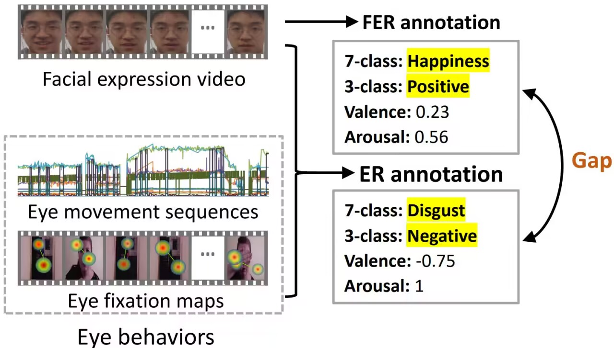

# SMAD
This is a Pytorch implementation of "SMAD: A New Behavioural and Physiological Signal-based Spontaneous Multimodal Affective Database for Emotion
Recognition"
## Details
The Spontaneous Multimodal Affective Database (SMAD) provide a multi-dimensional perspective on human emotions. It comprises both affective behavioral and physiological signals, namely eye movement sequences, emotion-related gaze comment videos, and facial expression videos, with 1,303 data and 121 participants. Most importantly, the SMAD offers a wide range of high-reliability emotion annotations by introducing an active learning-based annotation optimization approach. These annotations include 7-class discrete emotional labels (happiness, sadness, disgust, anger, fear, surprise, and neutral), emotional intensities for each discrete category, and emotional valence and arousal ratings. This extensive range of data and annotations makes the SMAD highly suitable for real-world applications. SMAD database has enormous diversities, large quantities, and rich annotations, including:

* 1303 number of data from 121 participants.
* three high-reliability emotion annotations:
  * 7-class discrete emotion categories, i.e., happiness, sadness, fear, disgust, surprise, anger, and neutral. 
  * Emotional intensities for each discrete category in the range [0,3].
  * Two-dimensional continuous emotion ratings, i.e., valence and arousal ratings in the range [-1,1].
* three subsets: facial expression subset, eye movement subset, and the emotion-
related gaze comment subset
* all manual and automatic annotations: includes 1 participant annotation, 4 expert annotations, and 1 automatic model annotation for each data.
* three benchmarks: multimodal emotion classification, multimodal valence and arousal regression and multimodal emotional intensity regression. 

## Example
<div align="center">

</div>

## Terms & Conditions
1. SMAD database is available for non-commercial research purposes only.
2. You agree not to reproduce, duplicate, copy, sell, trade, resell or exploit for commercial purposes, any portion of the clips, and any derived data.
3. You agree not to further copy, publish, or distribute any portion of the SMAD database. Except for internal use at a single site within the same organization, it is allowed to make copies of the dataset.

## How to get the SMAD Dataset
This database is publicly available. It is free for professors and researcher scientists affiliated to a University.

Permission to use but not reproduce or distribute the SMAD database is granted to all researchers given that the following steps are properly followed:

1. Download the `./data/SMAD academics-final.pdf` document.
2. Read the terms and conditions carefully to make sure they are acceptable, and fill in the relevant information at the end of the document.
3. Send the completed document to email.

## Content

* `./checkpoints`: Contains trained models.
* `./data`: Data storage location, contains database application pdf.
* `./dataset`: Contains database read files.（After requesting SMAD database we will provide the database read file.）
* `discrete_test_MAQT.py`: Emotion classification evaluation code.
* `valence_test_MAQT.py`: Valence regression evaluation code.
* `arousal_test_MAQT.py`: Arousal regression evaluation code.
* `intensity_test_MAQT.py`: Emotional intensity regression evaluation code.

## Requirements
* python 3.7.9
* Pytorch 1.7.1
* opencv-python 4.5.1

## Model
We provide trained model in `./checkpoints`.

## Usage
First, prepare SMAD data and put it in the folder `./data`. 
### Testing
We provide trained models in `./checkpoints` and evaluation codes for three tasks.
#### For Multimodal Emotion Classification
```
cd SMAD
python discrete_test_MAQT.py
```
#### For Multimodal Valence and Arousal Regression
```
cd SMAD
python valence_test_MAQT.py
python arousal_test_MAQT.py
```
#### For Multimodal Emotional Intensity Regression 
```
cd SMAD
python intensity_test_MAQT.py
```
